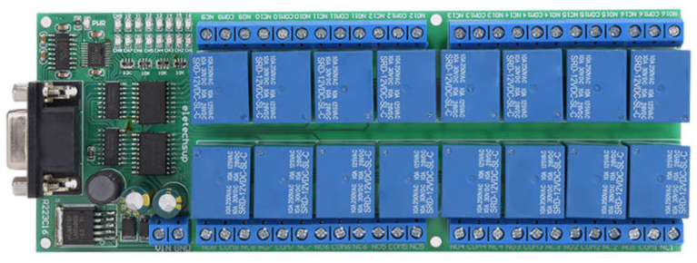

# rs232-relay-mqtt
## Home assistant - AppDaemon 4 app

This is an AppDaemon converter between rs232 relay board (usb uart) and mqtt for multi channel boards like this:



## Installation
1. This requires AppDeamon installed and configured (follow the documentation on their web site).
2. Add mqtt config to `/config/appdaemon/appdaemon.yaml`
   ```yaml
    appdaemon:
        plugins:
            MQTT:
                type: mqtt
                namespace: mqtt
                client_host: mqtt-broker-addr
                client_id: appdaemon
                user_name: mqtt-username
                client_password: mqtt-password
                event_name: MQTT_MESSAGE
   ```
3. Make sure that `pyserial` is incuded in the `python_packages` option
4. Copy the content of the appdaemon directory from this repository to your home assistant 
`/config/appdaemon` folder
4. Add configuration to your Home Assistant's `/config/appdaemon/apps/apps.yaml`

## Configuration
This is the configuration that goes into `/config/appdaemon/apps/apps.yaml`

### Example
```yaml
rs232-relay-mqtt:
  module: rs232-relay-mqtt
  class: Rs232RelayMqtt
  DEBUG: 1
  state_topic_prefix: "rs232/"
  command_topic: "rs232/{{device-id}}/set"
  device_ids: [1,2,3,4,5,6,7,8,9,A,B,C,D,E,F,G]
  payloads: {"open":"AT+O{{device-id}}", "close":"AT+C{{device-id}}", "read":"AT+R{{device-id}}"}
```

### Parameters
|Attribute |Required|Description
|:----------|----------|------------
| `module` | Yes | Always `rs232-relay-mqtt`
| `class` | Yes | Always `Rs232RelayMqtt`
| `DEBUG` | Yes | Flag that allow to log debug messages
| `state_topic_prefix` | Yes | Prefix of state topic
| `command_topic` | Yes | Command toppic to listen for `{{device-id}}` is replaced with provided ids from `device_ids` list
| `device_ids` | Yes | Identificators of possible values on board (this is for 16 channel board)
| `payloads` | Yes | Payloads translation for `open` is `AT+O1` send to serial

## MQTT sensor definition
```yaml
switch:
  - platform: mqtt
    name: "Relay 1"
    state_topic: "rs232/1"
    command_topic: "rs232/1/set"
    payload_on: "open"
    payload_off: "close"
    state_on: "on"
    state_off: "off"
```

## How it works
Mqtt switch sends command `rs232/1/set` with payload `open` to mqtt broker. App is listening for this topic and if payload is received (only knowned topics `rs232/{{device-id}}/set` payload are accpeted `open`,`close`,`read`). This payload is translated to `AT+O1` command and app send it to serial port. When answer from serial is received `Open1` app replaces `Open` to `state_topic_prefix` => `rs232/1`. To this topic is send payload `on`. 
`close` commands are similar to `open` command.